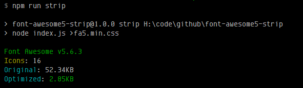

# font-awesome5-strip

Lightweight Font Awesome 5 css file generator with some icons for reduce size



### Installation

```bash
git clone https://github.com/ManzDev/font-awesome5-strip
cd font-awesome5-strip
npm install
```

### Usage

Edit `index.js` with your prefer editor and:

- Change `faversion` constant with your wanted **Font Awesome 5** version number.
- Add your wanted **icons** in `icons` array. The remaining icons will be deleted.
- Run script:

```bash
node index.js >filename.css
```

### Credits

font-awesome5-strip is not part of official Font Awesome 5.
Font Awesome 5 is property of Fonticons, Inc. https://fontawesome.com/